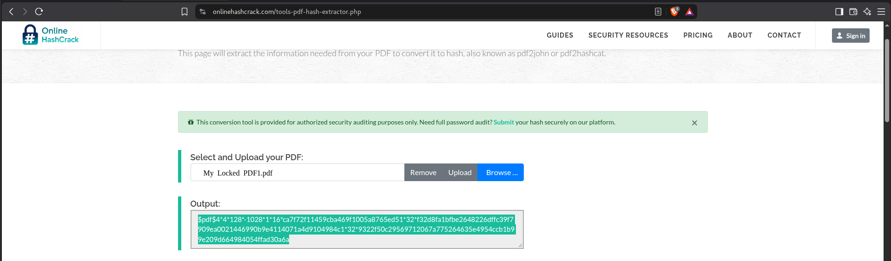
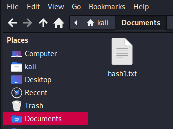
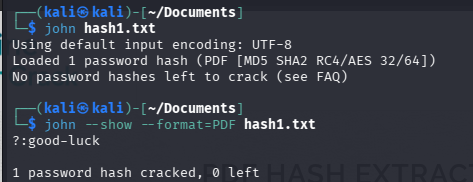
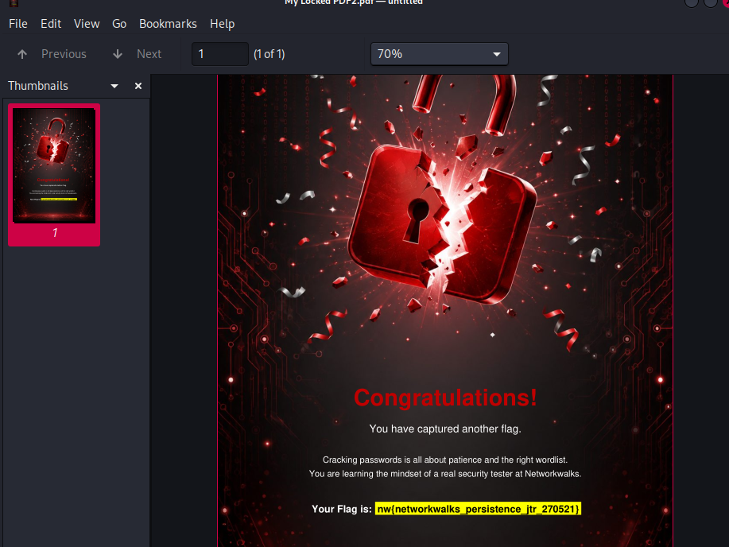
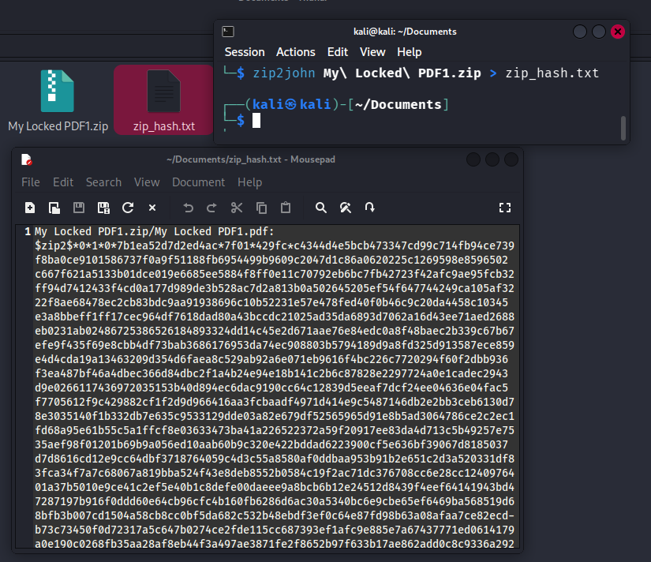
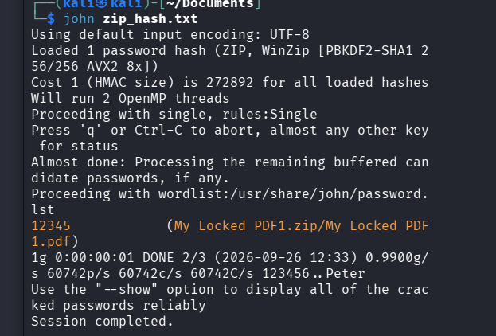
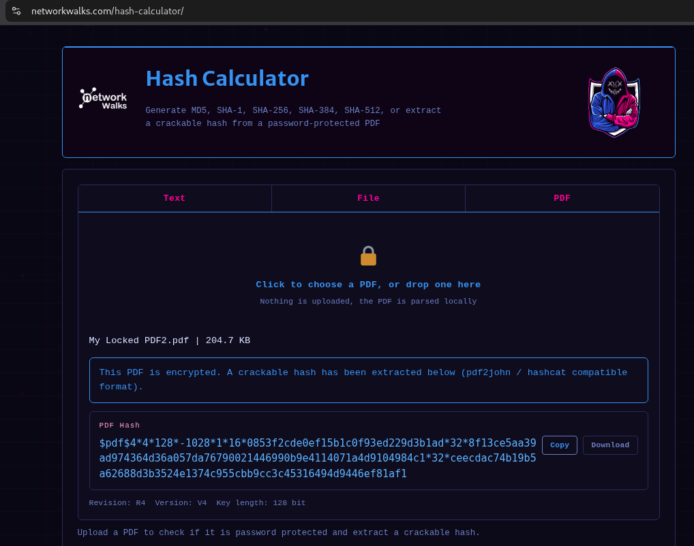
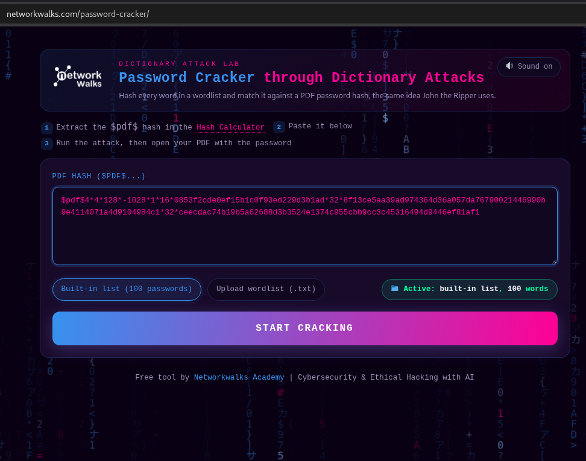
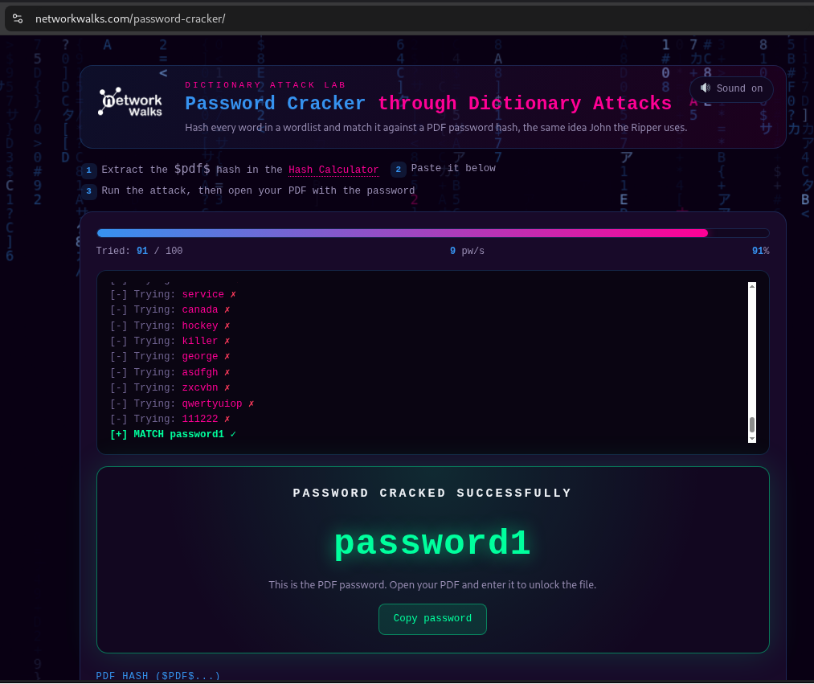

<div align="center">

# 🔐 Password Recovery with John the Ripper

**Practical password recovery and hash-cracking exercises using Kali Linux and John the Ripper**

</div>

<p align="center">
  
  
  
  
  
  
  
</p>

---

# 📌 Project Overview

This project focuses on **password recovery and hash cracking using John the Ripper** in Kali Linux.

The practical task involved recovering passwords from encrypted files in a controlled learning environment.

A total of **three encrypted files** were used during the exercise.

The basic workflow was:

1. Download the encrypted file.
2. Extract the password hash from the file.
3. Save the extracted hash into a text file.
4. Identify or determine the appropriate hash format.
5. Use John the Ripper to perform password recovery.
6. Display the recovered password.

In addition to completing the basic task, I explored several John the Ripper options to understand how different cracking modes and formats work.

---

# 🎯 Objectives

The main objectives of this project were to:

* Understand the basic concept of password hashing and password recovery.
* Learn how John the Ripper works.
* Extract password hashes from encrypted files.
* Save hashes in a format that John can process.
* Perform basic password recovery using John the Ripper.
* Understand how John detects hash formats.
* Explore supported John the Ripper formats.
* Use different John cracking modes.
* Use wordlists for password recovery.
* Display previously cracked passwords.
* Understand how `zip2john` can extract hashes from ZIP files.
* Document the commands, results, and problems encountered during the process.

---

# 🛠️ Tools Used

| Tool                         | Purpose                                                     |
| ---------------------------- | ----------------------------------------------------------- |
| 🐉 Kali Linux                | Cybersecurity testing environment                           |
| 🔐 John the Ripper           | Password recovery and hash cracking                         |
| 📄 Online PDF Hash Extractor | Extracting password hashes from PDF files                   |
| 📦 zip2john                  | Extracting hashes from password-protected ZIP files         |
| 📚 Wordlists                 | Providing candidate passwords for dictionary-based recovery |
| 💻 Terminal                  | Executing commands and analyzing results                    |

---

# 🔐 What is John the Ripper?

**John the Ripper** is a password security auditing and password recovery tool.

It can work with many different password hash formats and supports several password recovery techniques, including:

* Single crack mode
* Wordlist mode
* Incremental mode
* Format-specific cracking
* Automatic hash-format detection

John compares candidate passwords against the target hash until it finds a matching password.

It is commonly used for authorized password auditing, security testing, and educational purposes.

---

# 🪜 Basic Password Recovery Process

## Step 1. Obtain the Encrypted File

The encrypted file was first downloaded for the practical exercise.

Three encrypted files were tested during the project.

### Encrypted File 1

```text
[My Locked PDF1.pdf]
```

---

## Step 2. Extract the Hash

For the PDF files, an online PDF hash extraction tool was used to obtain the password hash.

The extracted hash was then saved into a `.txt` file so that John the Ripper could process it.

Example:

```text
hash1.txt
```

### Screenshot




---

## Step 3. Run John the Ripper

The basic John command used for the task was:

```bash
john hashfile.txt
```

John was allowed to automatically determine the appropriate hash format and attempt password recovery.

### Explanation

```text
john hash1.txt
```

* `john` starts John the Ripper.
* `hash1.txt` contains the extracted hash.
* John analyzes the hash and attempts to recover the password.

### Screenshot



---

# 📄 Encrypted File 1

The first encrypted file was processed using the basic John the Ripper workflow.

### Process

```text
Encrypted File
      ↓
Extract Hash
      ↓
Save Hash
      ↓
john hashfile.txt
      ↓
Password Recovered
```

### Hash Information

**Hash Format:**

```text
PDF [MD5 SHA2 RC4/AES 32/64]
```

**John the Ripper Format:**

```text
PDF
```

### Screenshot


---

# 📄 Encrypted File 2

The same password recovery process was performed on the second encrypted file.

### Command

```bash
john hash2.txt
```

### Result

The password was successfully recovered using John the Ripper.



---

# 📄 Encrypted File 3

The third encrypted file was also processed using John the Ripper.

### Command

```bash
john hash3.txt
```

### Result

The password was successfully recovered using John the Ripper.


---

# 🔬 Exploring John the Ripper

After completing the basic password recovery task, I explored additional John the Ripper commands to understand how the tool works beyond the basic `john hashfile.txt` command.

---

## 1. List Supported Formats

The following command was used to view the formats supported by John the Ripper:

```bash
john --list=formats
```

### Explanation

This command displays the password/hash formats that the installed version of John the Ripper supports.

This is useful when you already know the type of hash and want to tell John exactly which format to use.

---

# 🔎 2. Automatic Format Detection

John can often determine the hash format automatically.

```bash
john file_name.extension
```

When no `--format` option is provided, John attempts to identify the hash format automatically.

This was particularly useful during this project because the exact hash format could not initially be identified manually.

---

# 🎯 3. Specify the Hash Format

A specific format can also be provided manually:

```bash
john file_name.extension --format=hash_type
```

For example:

```bash
john hash1.txt --format=PDF
```

### Explanation

The `--format` option tells John which hash format it should use instead of relying on automatic detection.

This can be useful when:

* The format is already known.
* Automatic detection fails.
* Multiple formats may look similar.
* You want to explicitly control the cracking format.

---

# 👤 4. Single Crack Mode

John's single crack mode can be used with:

```bash
john --single file_name.extension --format=hash_type
```

### Explanation

Single crack mode generates password candidates using information associated with the username or account information contained in the input.

It is one of the password recovery modes provided by John the Ripper.

---

# 📚 5. Wordlist Mode

John can also use a wordlist containing possible passwords:

```bash
john --wordlist=wordlist_filePath file_name.extension --format=hash_type
```

Example:

```bash
john --wordlist=/usr/share/wordlists/rockyou.txt hashfile.txt --format=PDF
```

### Explanation

Wordlist mode tests candidate passwords from a supplied file against the target hash.

The quality of the wordlist can have a significant effect on the recovery process.

---

# 👀 6. Display Recovered Passwords

The `--show` option can be used to display passwords that John has already recovered:

```bash
john --show --format=hash_type file_name.extension
```

Example:

```bash
john --show --format=PDF hash1.txt
```

### Explanation

This command displays the passwords that John has already cracked for the specified hash file.

It is useful for checking the final recovery result without starting another cracking process.

For example image for file1 you can see i have use --show to see password.

---

# 📦 7. ZIP Password Hash Extraction with zip2john

John the Ripper also includes utilities for preparing hashes from certain file types.

For password-protected ZIP files, `zip2john` can be used to extract the password hash:

```bash
zip2john zip_file > file_name_to_store_hashValue
```

Example:

```bash
zip2john My Locked PDF1.zip > zip_hash.txt
```

The generated hash file can then be passed to John:

```bash
john zip_hash.txt
```

### Explanation

`zip2john` extracts the information required by John the Ripper from a password-protected ZIP archive.

The extracted data is saved to a file, which can then be processed by John.

### Screenshot





---

# Networkwalks Online Hash Calculator and Password Cracker

In addition to using John the Ripper in Kali Linux, I also tested the password recovery process using the external tools provided by Networkwalks. The process consisted of two steps: first generating the hash information from the PDF file, and then using the generated hash with the Networkwalks password cracker to recover the password.

## 1 Networkwalks Hash Calculator

The first step was performed using the Networkwalks Hash Calculator:

https://networkwalks.com/hash-calculator/

I uploaded the password-protected PDF file to the Hash Calculator and used the tool to generate the corresponding hash information. This demonstrated how a password-protected PDF can be converted into a hash representation that can be used for password-recovery testing.

**Evidence:** Insert the screenshot of the Networkwalks Hash Calculator result here.



## 2 Networkwalks Password Cracker

After obtaining the hash, I used the Networkwalks Password Cracker:

https://networkwalks.com/password-cracker/

The generated hash was provided to the password-cracking tool. The tool performed password-recovery attempts against the hash and successfully identified the password for the tested PDF file.

**Evidence:** Insert the screenshot of the Networkwalks Password Cracker result here.





## 3 Comparison with John the Ripper

This activity provided an opportunity to perform the same general password-recovery workflow using two different approaches. John the Ripper was used locally in Kali Linux, while the Networkwalks tools provided a web-based workflow consisting of hash generation followed by password cracking.

The John the Ripper output identified the loaded format as:

`PDF [MD5 SHA2 RC4/AES 32/64]`

and successfully recovered the password. The Networkwalks tools also successfully completed the hash-generation and password-recovery process for the tested PDF but Networkwalks is easy to use just upload and done. 

This comparison helped demonstrate that the same password-protected file can be analyzed using different security tools and workflows.


# 🐞 Problems Encountered & Solutions

Documenting problems encountered during password recovery was an important part of this project.

---

## Problem 1. Unable to Determine the Exact Hash Format

One of the main problems I faced was identifying the exact hash format.

I first tried using an online hash analyzer to determine the format, but I could not get a clear result.

Because the encrypted files were PDF files, the hash format was not immediately obvious from the extracted hash alone.

### Solution

Instead of manually specifying the format, I allowed John the Ripper to automatically detect the format:

```bash
john hashfile.txt
```

John successfully processed the hash and recovered the password.

The output also provided information about the detected format:

```text
PDF [MD5 SHA2 RC4/AES 32/64]
```

The corresponding John the Ripper format was:

```text
PDF
```

### Key Lesson

This showed me that manually identifying a hash format is not always necessary.

When John can recognize the format automatically, running:

```bash
john hashfile.txt
```

can be enough to begin the password recovery process.

---

# 💡 What I Learned

Through this project, I learned both the basic workflow and several advanced options of John the Ripper.

### 1. Password Hashes

I learned that password-protected files can store information in a form that allows password verification without directly storing the original password.

John the Ripper can use extracted hash information to attempt password recovery.

---

### 2. Hash Extraction

I learned that different file types may require different methods or utilities to extract information that John can process.

For example, `zip2john` can prepare password-protected ZIP files for John the Ripper.

---

### 3. Automatic Hash Detection

One of the most useful things I learned was that John can automatically identify supported hash formats.

```bash
john hashfile.txt
```

This was especially useful when I could not determine the hash format using an online analyzer.

---

### 4. Hash Format Selection

I learned how to explicitly specify a format using:

```bash
--format=hash_type
```

This gives more control over the cracking process when the format is already known.

---

### 5. Single Crack Mode

I learned about John's `--single` mode and how it provides another method for generating password candidates.

---

### 6. Wordlist Attacks

I learned how wordlists can be supplied to John using:

```bash
--wordlist=
```

This allows John to test a predefined collection of possible passwords.

---

### 7. Viewing Cracked Passwords

I learned how to use:

```bash
john --show
```

to display passwords that have already been recovered.

---

### 8. ZIP Hash Extraction

I learned that John the Ripper includes utilities such as `zip2john` that can extract password-related hash information from supported file formats.

---

### 9. Importance of Password Complexity

The practical exercises also demonstrated how password complexity can affect password recovery.

The files used in this exercise were recovered successfully, showing that weak or predictable passwords can be vulnerable to password-cracking techniques.

---

# 🎥 Demonstration

A video demonstration of the password recovery process is included with this project.

The video shows the process of extracting the hash and using John the Ripper to recover the password from one of the encrypted files.

### Video

**John the Ripper Password Recovery Demonstration is in my linkdin post**

[Linkdin_post](https://lnkd.in/p/giWBFMnj)

---

# 🛡️ Security & Ethical Use

Password recovery and hash-cracking techniques should only be performed on files, accounts, and systems that you own or have explicit permission to test.

The techniques demonstrated in this project were performed as part of a controlled cybersecurity learning exercise.

Do not use these techniques to access passwords or encrypted data without authorization.

---

# 🔗 Tools & Resources

* **Kali Linux**
* **John the Ripper**
* **John the Ripper Documentation**
* **Online PDF Hash Extractor**
* **zip2john**
* **Wordlists**

---

# 👤 Author

**Gautam Gupta**

Cybersecurity Enthusiast | Penetration Testing & Web Security

GitHub: `GautamRauniyar`

LinkedIn: `gautamgupta75289`

---

# 📌 Project Information

**Program:** NetworkWalks
**Batch:** B083
**Week:** 03
**Project:** Password Recovery with John the Ripper
**Environment:** Kali Linux
**Focus:** Password Recovery • Hash Cracking • John the Ripper
**Repository:** GitHub
